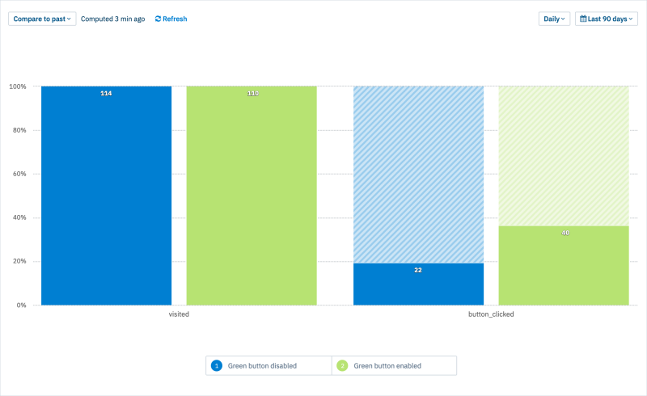

# How to implement and visualize an A/B test using ConfigCat and Amplitude 


The purpose of this sample is to demonstrate how to implement an A/B testing scenario
using ConfigCat. And how to visualize the A/B test results as a funnel using Amplitude. [Here is the blog post](https://configcat.com/blog) with more details.




### Run the sample locally:
To run the sample project you need [Angular CLI](https://cli.angular.io/) installed
```
npm install -g @angular/cli
```

1. Install dependencies
```
npm install
```
2. Run sample app
```
ng serve
```
3. Open browser at `http://localhost:4200/`


